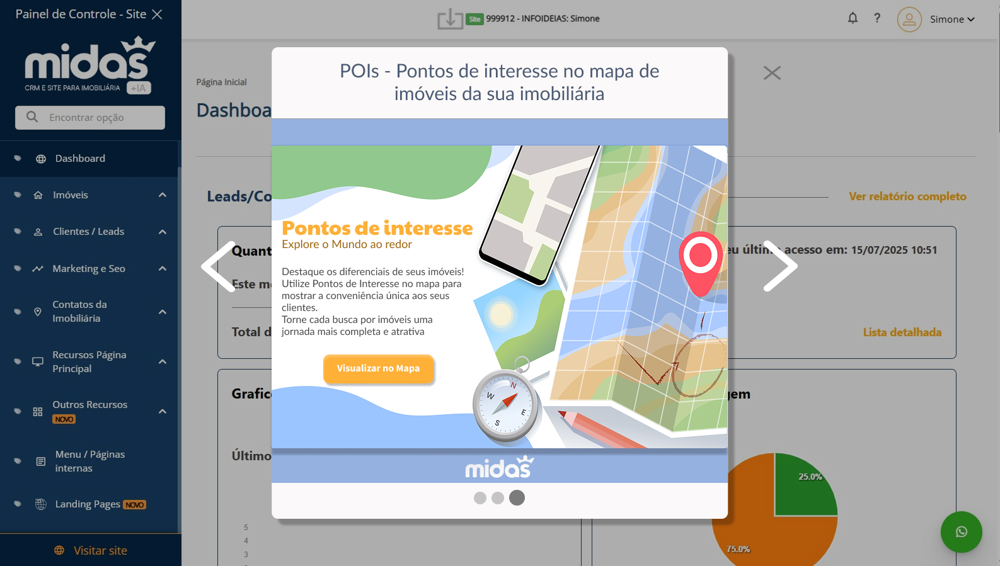
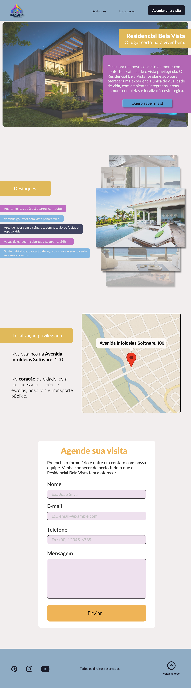

### Exercício 1 - Analisar o design de um pop-up e propor um redesenho.
Remodelei para um design mais clean, mas tentando manter o padrão da imagem ao fundo. o intuito era criar um design simples que funionasse para qualquer faixa etária.
- O botão de fechar estava pequeno e o título do pop up bloqueava parte dele. Pensando num layout mais clean, deixei ele maior, sem o texto de acompanhamento, trocando por um novo tom de cinza, assim ele não chama mais atenção que a imagem central;
- A cor do título recebeu um tom de azul que combina com a paleta da imagem, deixando mais harmonioso;
- A imagem "esticada" (de ponta a ponta no card apenas horizontalmente) e sem efeitos nas laterais centraliza a atenção do usuário onde importa;
- Cores do título e subtítulo na imagem suavizadas e modificadas para maior conforto ocular;
- Call to action renomeada para algo menos genérico, tornando o conteúdo do botão mais informativo;
- Cores e layout de "progresso" alterados para maior clareza.

### Exercício 2 - Criação de Layout para Landing Page
